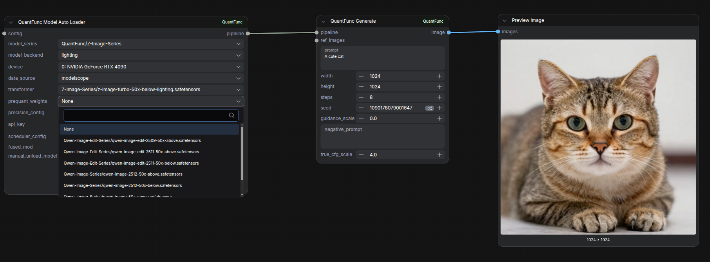

# Must-Read for Beginners: Generate Your First Image in 3 Nodes

[中文版本](tutorial-0-easy-gen_zh.md)

## Overview

This is the simplest way to get started. The **QuantFunc Model AutoLoader** node **automatically downloads** and configures models — just pick from dropdown menus, no manual downloads or paths needed.

The entire workflow has only **3 nodes**:

```
Model AutoLoader → Generate → Preview Image
```



> **Workflow file:** [`workflow_sample/QuantFunc-Easy-Gen.json`](../workflow_sample/QuantFunc-Easy-Gen.json)

> **Want more control?** This tutorial is a simplified auto-download version of [Tutorial 1 (Runtime Quantization)](tutorial-1-use-without-quantfunc-models.md). For advanced features like local models, LoRA stacking, and pipeline configuration, see Tutorial 1.

## Prerequisites

1. ComfyUI-QuantFunc plugin installed (see [README](../README.md))
2. CUDA 13.0+ runtime and cuDNN 9.x
3. Internet connection (models are downloaded automatically on first use)

## Steps

### Step 1: Import the Workflow

Import `workflow_sample/QuantFunc-Easy-Gen.json` in ComfyUI.

You'll see 3 nodes already connected — no extra setup needed.

### Step 2: Configure Model AutoLoader

In the **QuantFunc Model AutoLoader** node:

| Parameter | Description |
|-----------|-------------|
| `model_series` | Select a model series (e.g., `QuantFunc/Z-Image-Series`) |
| `model_backend` | Quantization backend: `svdq` or `lighting` |
| `device` | Your GPU (pick from the list) |
| `data_source` | Download source: `modelscope` or `huggingface` |
| `transformer` | Select specific transformer weights (auto-listed based on series) |

Leave other parameters at their defaults.

> **Tip:** After selecting `model_series`, the `transformer` dropdown automatically lists available weights. Choose the variant matching your GPU (`50x-below` for RTX 20/30/40, `50x-above` for RTX 50).

### Step 3: Configure Generation Parameters

In the **QuantFunc Generate** node:

| Parameter | Suggested Value |
|-----------|-----------------|
| `prompt` | Your text prompt (e.g., "A cute cat") |
| `width` / `height` | `1024` x `1024` |
| `steps` | `8` (Lightning distilled) or `20` (full model) |
| `seed` | Any number, or select `randomize` for auto-random |
| `guidance_scale` | `0` (Lightning distilled) or `3.5` (full model) |

### Step 4: Run

Click **Queue Prompt**. On first run, the plugin automatically downloads the model (speed depends on your connection). Subsequent runs use the cached model.

The generated image appears in the **Preview Image** node.

## Next Steps

- Want to use your own local models? → [Tutorial 1: Runtime Quantization](tutorial-1-use-without-quantfunc-models.md)
- Want to export quantized models for faster loading? → [Tutorial 2: Export Runtime-Quantized Models](tutorial-2-export-quantized-models.md)
- Want to understand SVDQ vs Lighting? → [Tutorial 3: Download & Use Pre-exported Models](tutorial-3-download-quantfunc-models.md)
