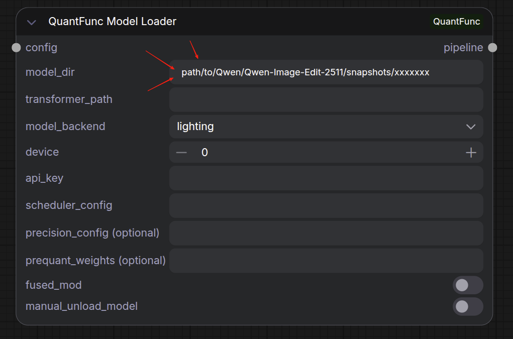
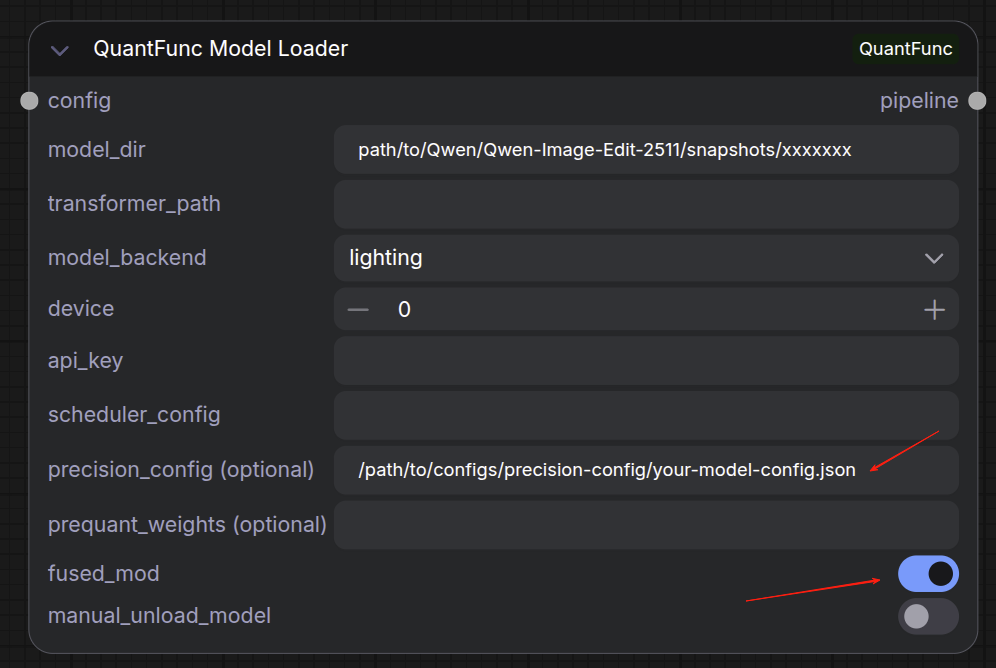
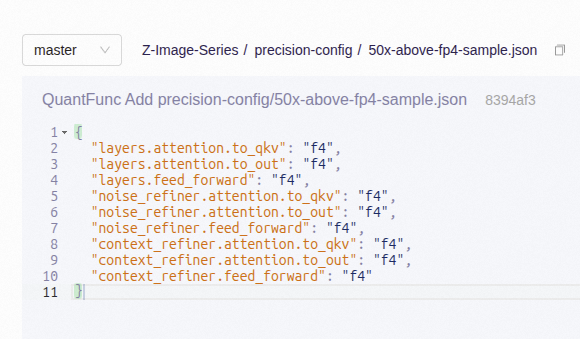
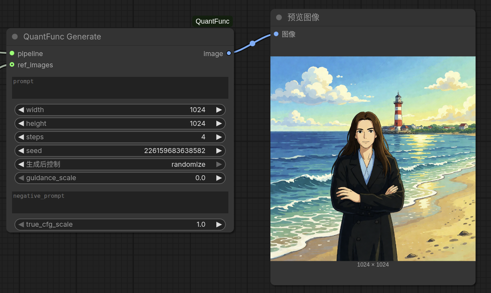
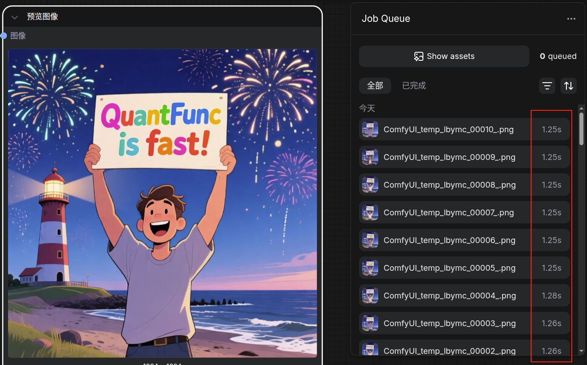
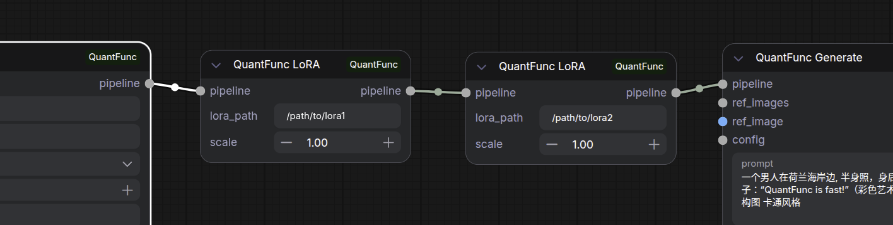
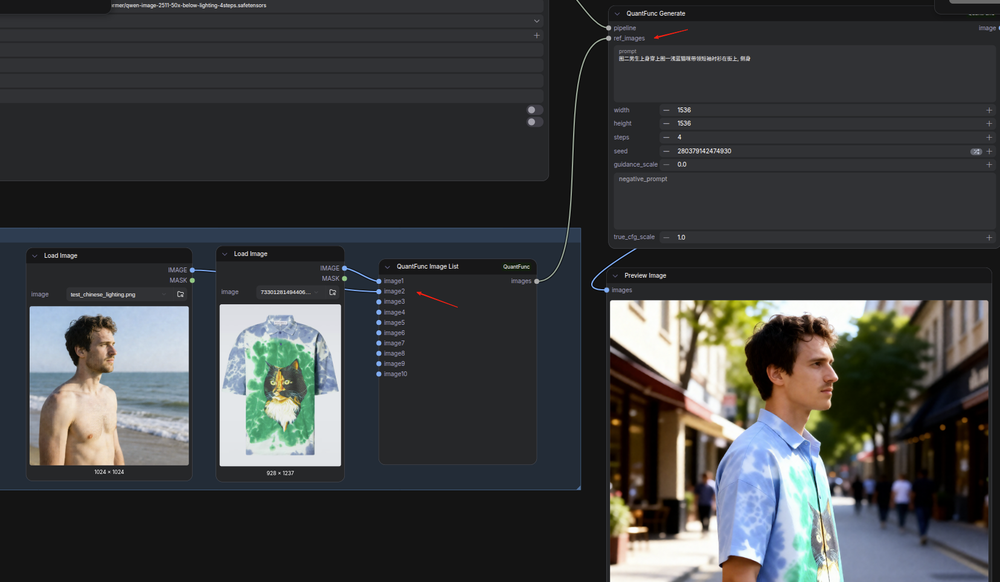
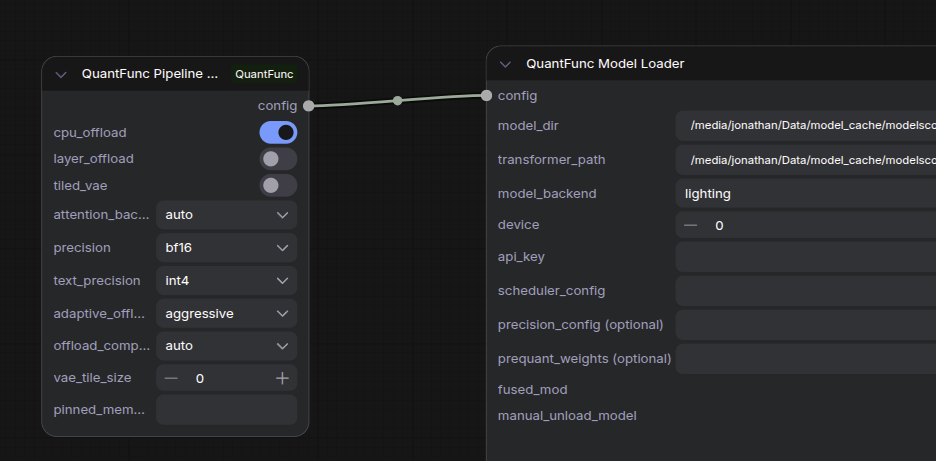

# Tutorial 1: Use Workflows Without Downloading QuantFunc Models

[中文版本](tutorial-1-use-without-quantfunc-models_zh.md)

## Overview

You **don't need** to download QuantFunc pre-quantized models to use this plugin. As long as you have a **diffusers-format** base model (e.g., [Qwen/Qwen-Image-Edit-2511](https://huggingface.co/Qwen/Qwen-Image-Edit-2511)), you can use the **Lighting backend** for real-time quantization and accelerated inference.

The Lighting backend quantizes FP16 weights to low precision at load time — no pre-conversion needed.

## Prerequisites

1. ComfyUI-QuantFunc plugin installed (see [README.md](../README.md))
2. CUDA 13.0+ runtime and cuDNN 9.x installed
3. A diffusers-format model downloaded locally:

```bash
# Using huggingface-cli
huggingface-cli download Qwen/Qwen-Image-Edit-2511 --local-dir /path/to/Qwen-Image-Edit-2511

# Or using git lfs
git lfs install
git clone https://huggingface.co/Qwen/Qwen-Image-Edit-2511 /path/to/Qwen-Image-Edit-2511
```

> **What is diffusers format?** The directory should contain a `model_index.json` file, plus subdirectories like `transformer/`, `vae/`, `tokenizer/`, etc.

## Steps

### Step 1: Import Workflow

Import `workflow_sample/QuantFunc-Text-to-Image-Workflow.json` into ComfyUI.

The workflow has two groups — SVDQ on the left, Lighting on the right. **Delete or ignore the SVDQ group** and use only the Lighting group on the right.



### Step 2: Configure Model Loader

In the **QuantFunc Model Loader** node:

| Parameter | Value |
|-----------|-------|
| `model_dir` | Your base model path, e.g., `/path/to/Qwen-Image-Edit-2511` |
| `transformer_path` | **Leave empty** — Lighting will quantize from FP16 on the fly |
| `model_backend` | Select `lighting` |
| `device` | GPU index (usually `0`) |
| `precision_config` | Per-layer precision config file path (see below) |
| `fused_mod` | Recommended `True` for Qwen series models (see below) |
| `prequant_weights` | Pre-quantized modulation weights path, recommended for low-VRAM GPUs (see below) |



#### About precision_config (Per-layer Precision Config)

`precision_config` is a key setting for the Lighting backend. It defines the quantization precision (e.g., INT4, INT8, FP8) for each transformer layer, allowing you to **balance speed and image quality** with fine-grained control.

**QuantFunc provides official recommended configs for each model series** — download and use them directly.

> **Note:** precision_config is **tied to the model architecture**. Configs from different model series are **not interchangeable**. Always download the config that matches your model.

For example, with the Qwen-Image-Edit series:

> Example download (Qwen-Image-Edit series):
> https://www.modelscope.cn/models/QuantFunc/Qwen-Image-Edit-Series/file/view/master/precision-config

```bash
# Example: download precision configs for Qwen-Image-Edit series
modelscope download --model QuantFunc/Qwen-Image-Edit-Series --include "precision-config/*" --local_dir /path/to/configs
```

For other model series, find the corresponding model repo on the [QuantFunc ModelScope page](https://www.modelscope.cn/models/QuantFunc) and look for the `precision-config` directory.

Then set in Model Loader:
```
precision_config = /path/to/configs/precision-config/your-model-config.json
```

> **If precision_config is not set**, the Lighting engine uses a default global quantization precision. Setting it can yield better image quality or faster speed, depending on the chosen config file.



#### About fused_mod (Fused Modulation Kernel)

When enabled, `fused_mod` fuses the modulation layer's SiLU, GEMV, bias, and split operations into a single FP16 kernel, reducing memory access overhead and improving inference speed.

> **Recommendation: When using Qwen series models (e.g., Qwen-Image-Edit-2511), set `fused_mod` to `True`.** The Qwen Transformer architecture benefits significantly from this optimization, yielding noticeable performance gains.

For other model architectures, whether this option helps depends on their modulation layer implementation. If unsure, keep the default (off).

#### Modulation Optimization: fused_mod vs prequant_weights (QwenImage Only)

QwenImage models offer two **mutually exclusive** modulation optimization options — choose based on your VRAM:

| Your VRAM | Recommended | How to Set |
|-----------|-------------|------------|
| **24 GB+** (RTX 4090, etc.) | `fused_mod = True` | Better image quality, model ~14 GB |
| **8–12 GB** (RTX 3060, etc.) | `prequant_weights = path` | Model ~11 GB, inference ~9s (vs 20s+ without) |

> **Note:** These two options are mutually exclusive — setting `prequant_weights` overrides `fused_mod`.

**Using prequant_weights:**

1. Download the `mod_weights.safetensors` file for your model from [QuantFunc ModelScope](https://www.modelscope.cn/models/QuantFunc) or HuggingFace
2. Set in Model Loader:
```
prequant_weights = /path/to/mod_weights.safetensors
```

> The option chosen during export is saved in model metadata and auto-enabled on load.

### Step 3: Configure Generation Parameters

In the **QuantFunc Generate** node:

| Parameter | Suggested Value |
|-----------|-----------------|
| `prompt` | Your text prompt |
| `width` / `height` | `1024` x `1024` (or model-supported size) |
| `steps` | `20` (full model) or `4` (Lightning distilled) |
| `guidance_scale` | `3.5` (adjust per model) |
| `seed` | Any number |



### Step 4: Run

Click **Queue Prompt**. The first run takes extra time as Lighting quantizes the model weights in real time. Subsequent runs use the cached quantized model.



## Node Connection Diagram

```
QuantFunc Model Loader (lighting, FP16)
    → QuantFunc LoRA (optional)
        → QuantFunc Generate
            → Preview Image
```

## Optional: Add LoRA

The Lighting backend supports **zero-cost LoRA stacking**. Insert **QuantFunc LoRA** nodes between Model Loader and Generate:

1. Set `lora_path` to your LoRA `.safetensors` file
2. Adjust `scale` (default: 1.0)
3. Chain multiple LoRA nodes for stacking

> Lighting backend does **not** require the QuantFunc LoRA Config node.



## Optional: Image Editing Mode

For image editing models (e.g., Qwen-Image-Edit-2511):

1. Import `workflow_sample/QuantFunc-Image-to-Image-Workflow.json`
2. Use **LoadImage** nodes to load reference images
3. Connect to **QuantFunc Image List** node
4. Connect Image List to Generate's `ref_images` input
5. Describe the edit in your prompt (e.g., "Change the background to a beach")

The node automatically switches to image editing mode when `ref_images` is connected.



## Optional: Advanced Pipeline Config

If you run into VRAM issues or want to fine-tune, add a **QuantFunc Pipeline Config** node connected to Model Loader:

| Parameter | Description |
|-----------|-------------|
| `cpu_offload` | Enable when VRAM is tight — offloads idle models to CPU |
| `layer_offload` | For extreme low-VRAM — loads transformer layer by layer |
| `tiled_vae` | Enable for high-resolution generation |
| `attention_backend` | Usually keep `auto` |
| `text_precision` | Text encoder precision — `int4` saves most VRAM |

> Most users don't need this — the plugin auto-optimizes.



## FAQ

**Q: First load is slow?**
A: Normal. Lighting quantizes model weights on the first run. Subsequent runs are much faster. Use [Tutorial 3](tutorial-3-export-custom-models.md) to export quantized models and skip this step.

**Q: Which models work?**
A: Any diffusers-format model. Check [QuantFunc official docs](https://www.modelscope.cn/models/QuantFunc) for supported architectures.

**Q: How does this compare to pre-quantized models?**
A: Pre-quantized models (SVDQ) load faster and run faster because quantization is done offline with more advanced SVD algorithms. Lighting from FP16 is more flexible but slightly slower. See [Tutorial 2](tutorial-2-download-and-use-quantfunc-models.md) for details.
