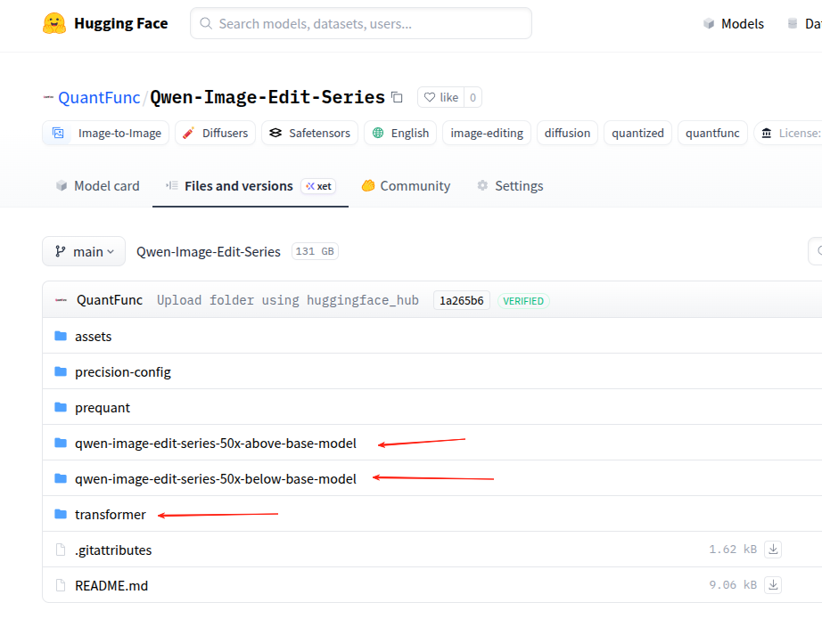
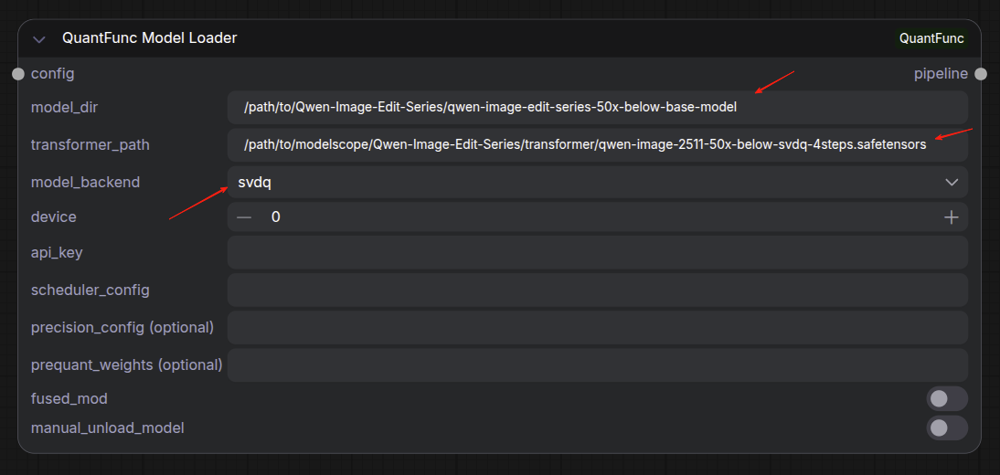
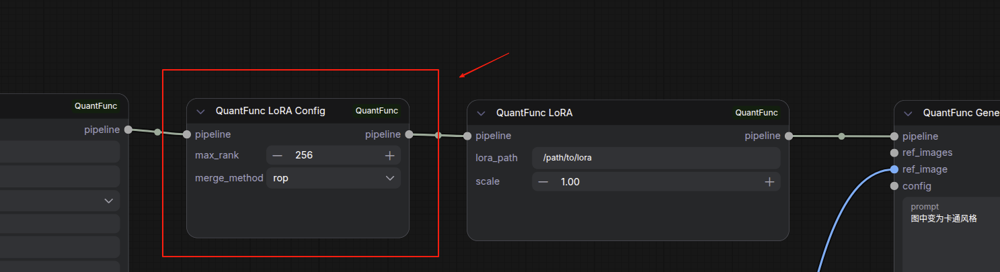

# 教程 2：下载并使用 QuantFunc 预量化模型获得极致加速

[English Version](tutorial-2-download-and-use-quantfunc-models.md)

## 概述

QuantFunc 提供**预量化模型**（SVDQ 格式），通过离线 SVD 量化算法将模型压缩为 INT4/INT8 精度。相比 Lighting 实时量化，SVDQ 预量化模型：

- **加载更快**：无需实时量化，直接加载预处理好的权重
- **推理更快**：使用更激进的量化策略，达到 2x-11x 加速
- **质量更好**：离线量化有更多时间优化，减少量化误差

## 第一步：确定你的 GPU 变体

QuantFunc 根据 GPU 架构提供不同版本的量化模型：

| GPU 变体 | 适用显卡 | 说明 |
|----------|----------|------|
| `50x-below` | RTX 20/30/40 系列 | 针对 Turing/Ampere/Ada 优化 |
| `50x-above` | RTX 50 系列 | 针对 Blackwell 优化 |

> **重要：** 基础模型和 Transformer 权重必须使用**相同的 GPU 变体**。

## 第二步：下载模型

从以下平台下载预量化模型：

- **ModelScope**: https://www.modelscope.cn/models/QuantFunc
- **HuggingFace**: https://huggingface.co/QuantFunc

每个模型仓库通常包含：

```
QuantFunc/SomeModel-SVDQ/
├── model_index.json          # diffusers 模型索引
├── transformer/              # 预量化的 Transformer 权重
│   └── *.safetensors
├── vae/                      # VAE 权重
├── tokenizer/                # Tokenizer
├── text_encoder/             # 文本编码器
└── scheduler/                # 调度器配置
```

下载示例：

```bash
# 使用 modelscope 下载（国内推荐）
pip install modelscope
modelscope download --model QuantFunc/YourModel-SVDQ --local_dir /path/to/QuantFunc-Model

# 或使用 huggingface-cli
huggingface-cli download QuantFunc/YourModel-SVDQ --local-dir /path/to/QuantFunc-Model
```



## 第三步：导入 Workflow 并配置

1. 在 ComfyUI 中导入 `workflow_sample/QuantFunc-Text-to-Image-Workflow.json`
2. 使用**左侧 SVDQ 组**



在 **QuantFunc Model Loader** 节点中配置：

| 参数 | 设置 |
|------|------|
| `model_dir` | QuantFunc 模型目录路径，例如 `/path/to/QuantFunc-Model` |
| `transformer_path` | Transformer 权重路径，例如 `/path/to/QuantFunc-Model/transformer/model.safetensors`（也兼容旧版 nunchaku 的量化权重） |
| `model_backend` | 选择 `svdq` |
| `device` | GPU 编号（通常为 `0`） |

## 第四步：配置生成参数

在 **QuantFunc Generate** 节点中：

| 参数 | 建议值 |
|------|--------|
| `prompt` | 你的文本提示词 |
| `width` / `height` | `1024` x `1024` |
| `steps` | `20`-`30`（完整模型），`4`（Lightning 蒸馏模型） |
| `guidance_scale` | `3.5` |
| `seed` | 任意数字 |


## 第五步：运行

点击 **Queue Prompt**。SVDQ 模型加载速度快，首次推理也不需要实时量化。


## 使用 LoRA（SVDQ 后端）

SVDQ 后端使用 LoRA 时，**必须**添加 **QuantFunc LoRA Config** 节点来控制合并策略：

```
Model Loader (svdq)
    → QuantFunc LoRA (你的 LoRA)
        → QuantFunc LoRA Config (合并策略)
            → QuantFunc Generate
```

**QuantFunc LoRA Config** 参数：

| 参数 | 说明 |
|------|------|
| `merge_method` | `auto`（推荐）—— 自动选择最佳方法 |
| | `rop` —— Rank-Orthogonal Projection（QuantFunc 创新算法，推荐） |
| | `awsvd` —— Activation-Weighted SVD |
| | `itc` —— IT+C 方法 |
| | `concat` —— 直接拼接（nunchaku 的实现方式） |
| `max_rank` | 最大合并 LoRA 秩（1-1024，推荐使用默认值或 `auto` 的 -1） |

> 这是因为 SVDQ 模型中已经融合了预量化的低秩结构，新增 LoRA 需要与已有结构合并。



## 图像编辑模式

与[教程 1](tutorial-1-use-without-quantfunc-models_zh.md) 相同：

1. 导入 `workflow_sample/QuantFunc-Image-to-Image-Workflow.json`
2. 使用 SVDQ 组配置 Model Loader
3. 加载参考图 → QuantFunc Image List → Generate 的 `ref_images`


## SVDQ vs Lighting 对比

| 维度 | SVDQ（预量化） | Lighting（实时量化） |
|------|----------------|---------------------|
| 模型来源 | 必须下载 QuantFunc 预量化模型 | 任意 diffusers FP16 模型 |
| 首次加载 | 快（直接加载） | 慢（需要实时量化） |
| 推理速度 | 最快（2x-11x） | 快（稍慢于 SVDQ） |
| 量化质量 | 最优（离线优化） | 良好 |
| LoRA 使用 | 需要 LoRA Config 节点 | 直接叠加，零成本 |
| 灵活性 | 受限于预量化模型 | 任意模型均可 |

## 常见问题

**Q: model_dir 和 transformer_path 有什么区别？**
A: `model_dir` 指向完整的 diffusers 模型目录（包含 VAE、tokenizer 等），`transformer_path` 指向具体的量化 Transformer 权重文件（.safetensors）。

**Q: 输出全是噪点？**
A: 请确认 `model_backend` 设为 `svdq`，且 Transformer 权重确实是 SVDQ 格式。使用 Lighting 格式的权重搭配 SVDQ 后端（或反之）会产生噪声输出。

**Q: 50x-below 和 50x-above 能混用吗？**
A: 不能。必须使用与你 GPU 匹配的变体，否则可能出错或性能下降。
