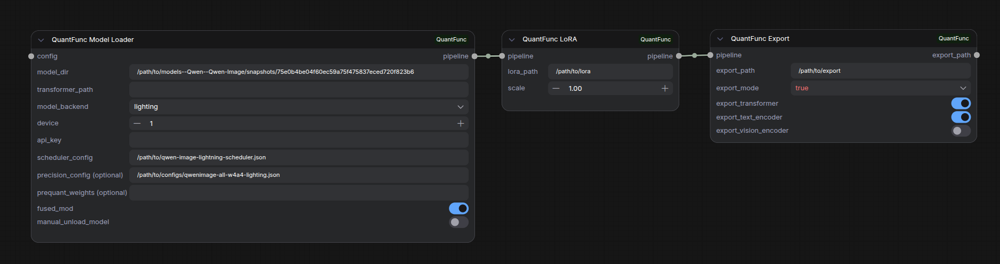

# Tutorial 2: Export Runtime-Quantized Models (with LoRA Fusion Support)

[中文版本](tutorial-2-export-quantized-models_zh.md)

## Overview

The Lighting backend performs **runtime quantization** every time a model is loaded. The **export** function saves all runtime-quantized models to disk, so subsequent loads skip re-quantization entirely. If you've also stacked LoRAs, they are permanently fused into the exported weights. Exported models:

- **All runtime-quantized models saved**: Skips runtime quantization on future loads — instant startup
- **LoRA fused in** (optional): Export can permanently fuse LoRAs into the model — no need to reload them each run
- **Shareable**: Exported models can be shared with others



> **Workflow file:** [`workflow_sample/QuantFunc-Model-Export.json`](../workflow_sample/QuantFunc-Model-Export.json)

## Use Cases

| Scenario | Description |
|----------|-------------|
| Skip runtime quantization | Export after Lighting runtime quantization to avoid re-quantizing every startup |
| LoRA baking | Permanently fuse your tuned LoRAs (with strength settings) into the model |
| Model distribution | Package configured models for team members |
| Multi-LoRA merge | Merge multiple LoRAs into a single model, simplifying workflows |

## Step 1: Import Export Workflow

Import `workflow_sample/QuantFunc-Model-Export.json` into ComfyUI.

## Step 2: Configure Model Loader

Choose your backend based on your model:

### Option A: Export Runtime-Quantized Models from FP16 (Lighting Backend)

If you're happy with the Lighting runtime quantization results, you can export the quantized model to disk. Next time you load it, the exported weights are read directly — skipping the runtime quantization step and **typically loading 2x faster or more**.

```
QuantFunc Model Loader (lighting)
    → QuantFunc LoRA (LoRA 1)
        → QuantFunc LoRA (LoRA 2, optional)
            → QuantFunc Export
```

The Lighting backend Model Loader config is the same as [Tutorial 1](tutorial-1-use-without-quantfunc-models.md):

| Parameter | Value |
|-----------|-------|
| `model_dir` | Your FP16 base model path, e.g., `/path/to/Qwen-Image-Edit-2511` |
| `transformer_path` | **Leave empty** — Lighting will quantize from FP16 on the fly |
| `model_backend` | `lighting` |
| `device` | GPU index (usually `0`) |
| `precision_config` | Per-layer precision config file path (see [Tutorial 1](tutorial-1-use-without-quantfunc-models.md)) |
| `fused_mod` | Recommended `True` for Qwen series models (mutually exclusive with `prequant_weights`) |
| `prequant_weights` | Pre-quantized modulation weights path, recommended for low-VRAM GPUs (mutually exclusive with `fused_mod`) |

> **Modulation optimization:** 24 GB+ VRAM → use `fused_mod = True` (better quality); 8–12 GB VRAM → use `prequant_weights` (model ~11 GB vs ~14 GB). The choice is saved in exported model metadata and auto-enabled on load. See [Tutorial 1's modulation optimization section](tutorial-1-use-without-quantfunc-models.md) for details.


### Option B: Export from SVDQ Model (SVDQ Backend)

If you already have an SVDQ model and want to permanently fuse specific LoRAs into it for export, use the SVDQ backend.

```
QuantFunc Model Loader (svdq)
    → QuantFunc LoRA (LoRA 1)
        → QuantFunc LoRA Config (merge strategy)
            → QuantFunc Export
```

The SVDQ backend Model Loader config is the same as [Tutorial 3](tutorial-3-download-quantfunc-models.md):

| Parameter | Value |
|-----------|-------|
| `model_dir` | QuantFunc model directory, e.g., `/path/to/QuantFunc-Model` |
| `transformer_path` | Transformer weight path, e.g., `/path/to/QuantFunc-Model/transformer/model.safetensors` (also compatible with legacy nunchaku quantized weights) |
| `model_backend` | `svdq` |
| `device` | GPU index (usually `0`) |

> When exporting from SVDQ with LoRAs, you must include the LoRA Config node. See [Tutorial 3's LoRA config section](tutorial-3-download-quantfunc-models.md) for details.


## Step 3: Add LoRAs (Optional)

Insert **QuantFunc LoRA** nodes between Model Loader and Export:

```
Model Loader → LoRA (scale=0.8) → LoRA (scale=1.2) → Export
```

Each LoRA node:
- `lora_path`: Path to LoRA file
- `scale`: LoRA strength (0.0-2.0)

> The LoRA strengths you set here are permanently fused into the exported model.


## Step 4: Configure Export Node

In the **QuantFunc Export** node:

| Parameter | Description |
|-----------|-------------|
| `export_path` | Output directory, e.g., `/path/to/my-exported-model` |
| `export_mode` | `all` — export full model (recommended, includes VAE, tokenizer, etc.) |
| | `custom` — select individual components |

With `custom` mode, you can control:

| Parameter | Description |
|-----------|-------------|
| `export_transformer` | Export transformer (quantized weights + fused LoRA) |
| `export_text_encoder` | Export text encoder |
| `export_vision_encoder` | Export vision encoder |

> **Recommended: use `all`** so the exported model is complete and standalone — usable directly as `model_dir`.


## Step 5: Execute Export

Click **Queue Prompt**. The export process will:

1. Load the base model
2. Apply all LoRAs (with configured strengths and merge strategy)
3. Perform runtime quantization (if Lighting from FP16)
4. Save all runtime-quantized model weights to the specified directory

After export, directory structure looks like:

```
my-exported-model/
├── model_index.json
├── transformer/
│   └── *.safetensors    ← quantized weights (with fused LoRA)
├── vae/
├── tokenizer/
├── text_encoder/
└── scheduler/
```


## Step 6: Use Exported Models

Load exported models in two ways:

### Option A: As a Full Model (Recommended, for `all` export mode)

| Parameter | Value |
|-----------|-------|
| `model_dir` | `/path/to/my-exported-model` |
| `transformer_path` | Leave empty or point to exported transformer weights |
| `model_backend` | `lighting` (exported runtime-quantized weights load directly, no re-quantization) |

### Option B: Replace Only Transformer Weights

| Parameter | Value |
|-----------|-------|
| `model_dir` | Original base model path |
| `transformer_path` | `/path/to/my-exported-model/transformer/model.safetensors` |
| `model_backend` | Same as when exported |

> You do **not** need to add the previous LoRA nodes — they're already fused in.


## Full Example: End to End

Assume you have:
- Base model: `/models/FLUX.1-dev/`
- Style LoRA: `/loras/anime-style.safetensors` (strength 0.8)
- Detail LoRA: `/loras/detail-enhancer.safetensors` (strength 1.2)

**Export flow:**

```
Model Loader                    Export
  model_dir: /models/FLUX.1-dev/    export_path: /models/my-anime-flux/
  transformer_path: (empty)          export_mode: all
  model_backend: lighting
      ↓
  LoRA (anime-style, scale=0.8)
      ↓
  LoRA (detail-enhancer, scale=1.2)
      ↓
  Export
```

**Using the exported model:**

```
Model Loader                    Generate
  model_dir: /models/my-anime-flux/   prompt: "1girl, anime style..."
  transformer_path: (empty)            steps: 20
  model_backend: lighting              ...
      ↓
  Generate → Preview Image
```

No LoRA nodes needed — load and go!

## FAQ

**Q: Can I add new LoRAs on top of an exported model?**
A: For SVDQ-exported models, yes — you can stack new LoRAs (with the LoRA Config node). However, **Lighting-exported models do not currently support adding new LoRAs** — if you need a different LoRA combination, re-export from the original FP16 model.

**Q: How long does export take?**
A: Depends on model size and backend. Lighting export includes runtime quantization time (a few minutes). SVDQ export is faster since weights are already quantized.

**Q: How large are exported models?**
A: INT4 quantized transformer weights are typically ~1/4 the size of FP16. Total size depends on components included (VAE, tokenizer, etc.).

**Q: When should I use `custom` export mode?**
A: When you only want to update transformer weights (e.g., new LoRA combination) while keeping VAE, tokenizer unchanged — saves time and space.
