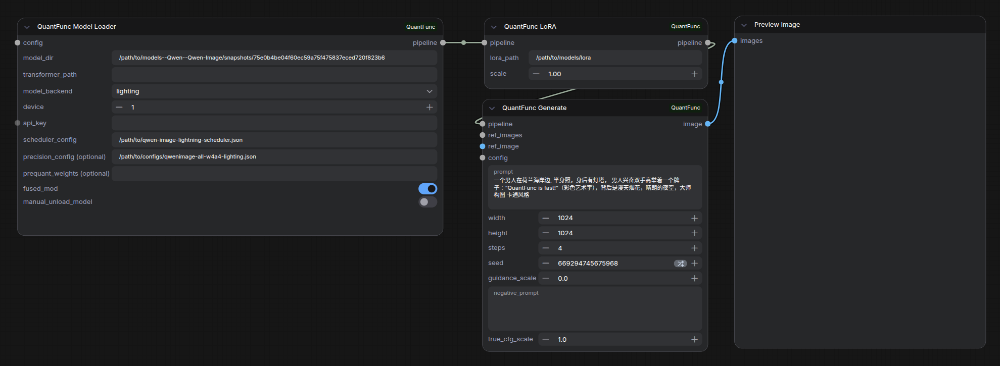

# Tutorial 3: Download and Use Pre-exported Quantized Models

[中文版本](tutorial-3-download-quantfunc-models_zh.md)

## Overview

QuantFunc has pre-exported commonly used models that were runtime-quantized using the Lighting engine. You can download these **pre-exported quantized models** directly and use them immediately — no need to perform runtime quantization yourself.

These models offer:

- **Instant loading**: No runtime quantization needed — loads pre-exported weights directly
- **Fast inference**: 2x-11x speedup
- **Ready to use**: Download, set path, and go



> **Workflow files (use the SVDQ group on the left side):**
> - Text-to-image: [`workflow_sample/QuantFunc-Text-to-Image-Workflow.json`](../workflow_sample/QuantFunc-Text-to-Image-Workflow.json)
> - Image editing: [`workflow_sample/QuantFunc-Image-to-Image-Workflow.json`](../workflow_sample/QuantFunc-Image-to-Image-Workflow.json)

## Step 1: Determine Your GPU Variant

QuantFunc provides different quantized model versions by GPU architecture:

| GPU Variant | Compatible GPUs | Notes |
|-------------|----------------|-------|
| `50x-below` | RTX 20/30/40 series | Optimized for Turing/Ampere/Ada |
| `50x-above` | RTX 50 series | Optimized for Blackwell |

> **Important:** Base model and transformer weights must use the **same GPU variant**.

## Step 2: Download Models

Download pre-quantized models from:

- **ModelScope**: https://www.modelscope.cn/models/QuantFunc
- **HuggingFace**: https://huggingface.co/QuantFunc

Each model repo typically contains:

```
QuantFunc/SomeModel-SVDQ/
├── model_index.json          # diffusers model index
├── transformer/              # pre-quantized transformer weights
│   └── *.safetensors
├── vae/                      # VAE weights
├── tokenizer/                # Tokenizer
├── text_encoder/             # Text encoder
└── scheduler/                # Scheduler config
```

Download example:

```bash
# Using modelscope (recommended for China)
pip install modelscope
modelscope download --model QuantFunc/YourModel-SVDQ --local_dir /path/to/QuantFunc-Model

# Or using huggingface-cli
huggingface-cli download QuantFunc/YourModel-SVDQ --local-dir /path/to/QuantFunc-Model
```


## Step 3: Import Workflow and Configure

1. Import `workflow_sample/QuantFunc-Text-to-Image-Workflow.json` into ComfyUI
2. Use the **left-side SVDQ group**


Configure the **QuantFunc Model Loader** node:

| Parameter | Value |
|-----------|-------|
| `model_dir` | QuantFunc model directory, e.g., `/path/to/QuantFunc-Model` |
| `transformer_path` | Transformer weight path, e.g., `/path/to/QuantFunc-Model/transformer/model.safetensors` (also compatible with legacy nunchaku quantized weights) |
| `model_backend` | Select `svdq` |
| `device` | GPU index (usually `0`) |

## Step 4: Configure Generation Parameters

In the **QuantFunc Generate** node:

| Parameter | Suggested Value |
|-----------|-----------------|
| `prompt` | Your text prompt |
| `width` / `height` | `1024` x `1024` |
| `steps` | `20`-`30` (full model) or `4` (Lightning distilled) |
| `guidance_scale` | `3.5` |
| `seed` | Any number |


## Step 5: Run

Click **Queue Prompt**. SVDQ models load quickly with no runtime quantization overhead.


## Using LoRA with SVDQ Backend

When using LoRA with SVDQ, you **must** add a **QuantFunc LoRA Config** node to control the merge strategy:

```
Model Loader (svdq)
    → QuantFunc LoRA (your LoRA)
        → QuantFunc LoRA Config (merge strategy)
            → QuantFunc Generate
```

**QuantFunc LoRA Config** parameters:

| Parameter | Description |
|-----------|-------------|
| `merge_method` | `auto` (recommended) — auto-selects best method |
| | `rop` — Rank-Orthogonal Projection (QuantFunc innovation, recommended) |
| | `awsvd` — Activation-Weighted SVD |
| | `itc` — IT+C method |
| | `concat` — Direct concatenation (nunchaku's approach) |
| `max_rank` | Max merged LoRA rank (1-1024, use default or `-1` for auto) |

> This is needed because SVDQ models have pre-quantized low-rank structures fused in, and new LoRAs must be merged with the existing structure.


## Image Editing Mode

Same as [Tutorial 1](tutorial-1-use-without-quantfunc-models.md):

1. Import `workflow_sample/QuantFunc-Image-to-Image-Workflow.json`
2. Configure Model Loader using the SVDQ group
3. Load reference images → QuantFunc Image List → Generate's `ref_images`


## SVDQ vs Lighting Comparison

| Dimension | SVDQ (Offline Quantization) | Lighting (Runtime Quantization) |
|-----------|-----------------------|----------------------|
| Model source | Must download QuantFunc models | Any diffusers FP16 model |
| First load | Fast (direct load) | Slow (runtime quantization on first load) |
| Inference speed | 2x-11x | 2x-11x (on sub-RTX 50 GPUs, ~20% faster than SVDQ) |
| Quantization quality | Good (offline optimized) | Good |
| LoRA usage | Requires LoRA Config node | Direct stacking, zero cost |
| Flexibility | Limited to pre-quantized models | Any model works |
| Export | Re-export with LoRA fused in | Export all runtime-quantized models to skip re-quantization |

## FAQ

**Q: What's the difference between model_dir and transformer_path?**
A: `model_dir` points to the full diffusers model directory (includes VAE, tokenizer, etc.), while `transformer_path` points to the specific quantized transformer weight file (.safetensors).

**Q: Output is all noise?**
A: Ensure `model_backend` is set to `svdq` and the transformer weights are actually in SVDQ format. Using Lighting weights with SVDQ backend (or vice versa) produces noisy output.

**Q: Can I mix 50x-below and 50x-above?**
A: No. You must use the variant matching your GPU, otherwise you may get errors or degraded performance.
