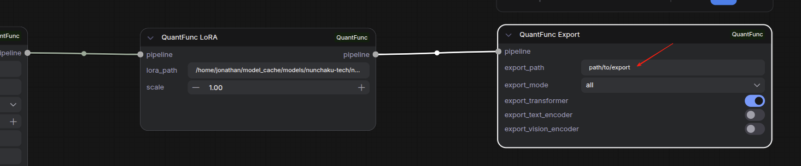
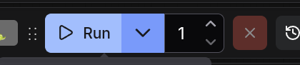

# Tutorial 3: Export Custom Models with LoRA as Lighting/SVDQ Models

[中文版本](tutorial-3-export-custom-models_zh.md)

## Overview

If you've carefully tuned your model with specific LoRA combinations, you can **export the entire configuration** as a pre-quantized model in one click. Exported models:

- **LoRA baked in**: No need to reload LoRAs each run
- **Quantized weights saved**: Skips real-time quantization, loads instantly
- **Shareable**: Exported models can be shared with others

## Use Cases

| Scenario | Description |
|----------|-------------|
| LoRA baking | Permanently fuse your tuned LoRAs (with strength settings) into the model |
| Faster loading | Export after Lighting quantization to skip it next time |
| Model distribution | Package configured models for team members |
| Multi-LoRA merge | Merge multiple LoRAs into a single model, simplifying workflows |

## Step 1: Import Export Workflow

Import `workflow_sample/QuantFunc-Model-Export.json` into ComfyUI.

## Step 2: Configure Model Loader

Choose your backend based on your model:

### Option A: Export from FP16 Model (Lighting Backend)

```
QuantFunc Model Loader (lighting)
    → QuantFunc LoRA (LoRA 1)
        → QuantFunc LoRA (LoRA 2, optional)
            → QuantFunc Export
```

The Lighting backend Model Loader config is the same as [Tutorial 1](tutorial-1-use-without-quantfunc-models.md):

| Parameter | Value |
|-----------|-------|
| `model_dir` | Your FP16 base model path, e.g., `/path/to/Qwen-Image-Edit-2511` |
| `transformer_path` | **Leave empty** — Lighting will quantize from FP16 on the fly |
| `model_backend` | `lighting` |
| `device` | GPU index (usually `0`) |
| `precision_config` | Per-layer precision config file path (see [Tutorial 1](tutorial-1-use-without-quantfunc-models.md)) |
| `fused_mod` | Recommended `True` for Qwen series models |


### Option B: Export from SVDQ Model (SVDQ Backend)

```
QuantFunc Model Loader (svdq)
    → QuantFunc LoRA (LoRA 1)
        → QuantFunc LoRA Config (merge strategy)
            → QuantFunc Export
```

The SVDQ backend Model Loader config is the same as [Tutorial 2](tutorial-2-download-and-use-quantfunc-models.md):

| Parameter | Value |
|-----------|-------|
| `model_dir` | QuantFunc model directory, e.g., `/path/to/QuantFunc-Model` |
| `transformer_path` | Transformer weight path, e.g., `/path/to/QuantFunc-Model/transformer/model.safetensors` (also compatible with legacy nunchaku quantized weights) |
| `model_backend` | `svdq` |
| `device` | GPU index (usually `0`) |

> When exporting from SVDQ with LoRAs, you must include the LoRA Config node. See [Tutorial 2's LoRA config section](tutorial-2-download-and-use-quantfunc-models.md) for details.


## Step 3: Add LoRAs (Optional)

Insert **QuantFunc LoRA** nodes between Model Loader and Export:

```
Model Loader → LoRA (scale=0.8) → LoRA (scale=1.2) → Export
```

Each LoRA node:
- `lora_path`: Path to LoRA file
- `scale`: LoRA strength (0.0-2.0)

> The LoRA strengths you set here are permanently baked into the exported model.


## Step 4: Configure Export Node

In the **QuantFunc Export** node:

| Parameter | Description |
|-----------|-------------|
| `export_path` | Output directory, e.g., `/path/to/my-exported-model` |
| `export_mode` | `all` — export full model (recommended, includes VAE, tokenizer, etc.) |
| | `custom` — select individual components |

With `custom` mode, you can control:

| Parameter | Description |
|-----------|-------------|
| `export_transformer` | Export transformer (quantized weights + baked LoRA) |
| `export_text_encoder` | Export text encoder |
| `export_vision_encoder` | Export vision encoder |

> **Recommended: use `all`** so the exported model is complete and standalone — usable directly as `model_dir`.



## Step 5: Execute Export

Click **Queue Prompt**. The export process will:

1. Load the base model
2. Apply all LoRAs (with configured strengths and merge strategy)
3. Perform quantization (if Lighting from FP16)
4. Save quantized weights to the specified directory

After export, directory structure looks like:

```
my-exported-model/
├── model_index.json
├── transformer/
│   └── *.safetensors    ← quantized weights (with baked LoRA)
├── vae/
├── tokenizer/
├── text_encoder/
└── scheduler/
```



## Step 6: Use Exported Models

Load exported models in two ways:

### Option A: As a Full Model (Recommended, for `all` export mode)

| Parameter | Value |
|-----------|-------|
| `model_dir` | `/path/to/my-exported-model` |
| `transformer_path` | Leave empty or point to exported transformer weights |
| `model_backend` | `lighting` (exported quantized weights load as pre-quantized) |

### Option B: Replace Only Transformer Weights

| Parameter | Value |
|-----------|-------|
| `model_dir` | Original base model path |
| `transformer_path` | `/path/to/my-exported-model/transformer/model.safetensors` |
| `model_backend` | Same as when exported |

> You do **not** need to add the previous LoRA nodes — they're already baked in.


## Full Example: End to End

Assume you have:
- Base model: `/models/FLUX.1-dev/`
- Style LoRA: `/loras/anime-style.safetensors` (strength 0.8)
- Detail LoRA: `/loras/detail-enhancer.safetensors` (strength 1.2)

**Export flow:**

```
Model Loader                    Export
  model_dir: /models/FLUX.1-dev/    export_path: /models/my-anime-flux/
  transformer_path: (empty)          export_mode: all
  model_backend: lighting
      ↓
  LoRA (anime-style, scale=0.8)
      ↓
  LoRA (detail-enhancer, scale=1.2)
      ↓
  Export
```

**Using the exported model:**

```
Model Loader                    Generate
  model_dir: /models/my-anime-flux/   prompt: "1girl, anime style..."
  transformer_path: (empty)            steps: 20
  model_backend: lighting              ...
      ↓
  Generate → Preview Image
```

No LoRA nodes needed — load and go!

## FAQ

**Q: Can I add new LoRAs on top of an exported model?**
A: Yes. The exported model is a regular quantized model — you can still stack new LoRAs on top.

**Q: How long does export take?**
A: Depends on model size and backend. Lighting from FP16 requires quantization time (a few minutes). SVDQ export is faster.

**Q: How large are exported models?**
A: INT4 quantized transformer weights are typically ~1/4 the size of FP16. Total size depends on components included (VAE, tokenizer, etc.).

**Q: When should I use `custom` export mode?**
A: When you only want to update transformer weights (e.g., new LoRA combination) while keeping VAE, tokenizer unchanged — saves time and space.
